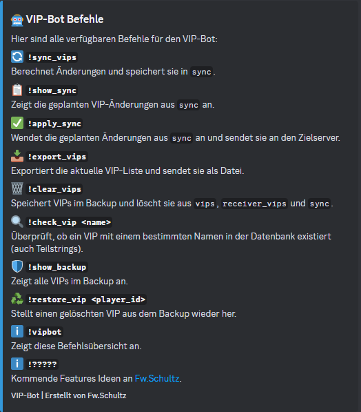

<div align="center">

  
  <h1>VIP-Exchanger-Bot</h1>
  
<!-- Badges -->
<p>
  <a href="https://github.com/FwSchultz/Discord-VIP-Exchanger/graphs/contributors">
    
  </a>
  <a href="">
    
  </a>
  <a href="https://github.com/FwSchultz/Discord-VIP-Exchanger/network/members">
    
  </a>
  <a href="https://github.com/FwSchultz/Discord-VIP-Exchanger/stargazers">
    
  </a>
  <a href="https://github.com/FwSchultz/Discord-VIP-Exchanger/issues/">
    
  </a>
  <a href="https://github.com/FwSchultz/Discord-VIP-Exchanger/blob/master/LICENSE">
    
  </a>
</p>
   
<h4>
    <a href="https://github.com/FwSchultz/Discord-VIP-Exchanger">Documentation</a>
  <span> · </span>
    <a href="https://github.com/FwSchultz/Discord-VIP-Exchanger/issues/">Report Bug</a>
  <span> · </span>
    <a href="https://github.com/FwSchultz/Discord-VIP-Exchanger/issues/">Request Feature</a>
  </h4>
</div>

<br />

<!-- Table of Contents -->
# Table of Contents

- [About the Project](#about-the-project)
- [Tech Stack](#tech-stack)
- [Environment Variables](#environment-variables)
- [Requirements](#requirements)
- [Getting Started](#getting-started)
- [Usage](#usage)
- [Commands](#commands)
- [Roadmap](#roadmap)
- [License](#license)
- [Contact](#contact)

---

## About the Project
The **VIP-Exchanger-Bot** is a Discord bot for synchronizing and managing VIP lists for Hell Let Loose servers. The bot can synchronize VIP lists between servers, perform automatic synchronizations and manage VIPs.

---

## Tech Stack
- **Programming language:** Python 3.12
- **Libraries:** `discord.py`, `python-dotenv`, `aiohttp`, `requests`
- **Database:** SQLite3

---

## Environment Variables
The following environment variables must be defined in an `.env` file:

```env
DISCORD_BOT_TOKEN=<YOUR DISCORD BOT TOKEN>
RCON_API_TOKEN=<API TOKEN FROM CRCON-TOOL>
RCON_API_URL=<CRCON API URL>
TARGET_API_URL=<TARGETSERVER API URL>
TARGET_API_TOKEN=<API TOKEN FROM CRCON-TARGERTSERVER>
DB_FILE=vips.db
ALLOWED_ROLES=123456789012345678,987654321098765432
VIP_REGEX=(\S+)\s(.+)\s(\d{4}-\d{2}-\d{2}T.+)
VIP_FILTERS=VIP,Admin,Mod #z.B. KL,23.,[100.]
AUTO_SYNC_INTERVAL=24  # Synchronization of the filtered VIP list every 24 hours
VIP_LOG_CHANNEL=1329971694609240116 #Channel for notifications of VIP changes
```

---

## Requirements

### 1. VIP list
The VIP list must be maintained in such a way that you can clearly identify your members. It is recommended to put a 'clan tag' in front of each name. Example data:
```
<SteamID>          <Clantag. Name>  <expiration date>
12345678912345342  [KL]Schultz  3000-01-01T00:00:00+00:00
```
A tab should be used between SteamID, name and expiration date.

### 2. CRCON-API rights and API-Token
The following authorizations must be set up so that the bot can work correctly with the RCON API under http://<ip>:<port>/admin/:

#### VIP management
- **`can_download_vip_list`**: Download the VIP list.
- **`can_add_vip`**: To add VIPs.
- **`can_remove_vip`**: For removing VIPs.
- **`can_view_vip_ids`**: To retrieve the IDs of VIPs.

#### Player information
- **`can_view_playerids`**: To retrieve player IDs and names.
- **`can_view_detailed_players`**: For detailed player information.
- **`can_view_player_info`**: For basic player information (name, Steam ID, etc.).

#### API token:
```
Create an additional API token that will be required later in the .env
```

---

## Getting Started

### 1. Create a Discord Bot

#### 1.1 Create a new application in the [Discord Developer Portal](https://discord.com/developers/applications).

#### 1.2 Navigate to the `Bot` tab:

```
- Take a Username for your Bot and a Icon if you want.
- Push the Button RESET TOKEN and save your Discord Token that you need for the .env later
- Enable the "Message Content Intent" under Privileged Gateway Intents.
```

#### 1.3 Go to the `Installation` tab and grant the bot the following permissions under `Scopes` and `Bot Permissions` (Guild Install):

```discord bot permissions
SCOPES: applications.commands and bot
PERMISSIONS: READ MESSAGE HISTORY, SEND MESSAGES, ATTACH FILES, EMBED LINKS, and Manage Messages

INSTALLATION: Copy the install link and run it in your browser.
```

### 2. Clone the Repository
```bash
# Clone the project repository
git clone https://github.com/FwSchultz/Discord-VIP-Exchanger
cd Discord-VIP-Exchanger
```

### 3. Set up virtual environment (venv)
A **virtual environment (venv)** makes it possible to manage dependencies for the bot in isolation. This ensures that the installed packages do not overlap with other Python projects.

#### 3.1 Install Python and venv (if not already installed)
```bash
sudo apt update && sudo apt install python3 python3-venv python3-pip -y  # Debian/Ubuntu
sudo dnf install python3 python3-venv python3-pip -y  # Fedora
sudo yum install python3 python3-venv python3-pip -y  # CentOS/RHEL
```

#### 3.2 Change to the desired project folder (if your bot is in /home/user/bot)
```bash
cd /home/user/bot
```

#### 3.3 Create, activate/deactivate virtual environment and install dependencies
```bash
python3.12 -m venv venv && source venv/bin/activate && pip install -r requirements.txt && deactivate
```


### 3. Configure Environment Variables

#### 3.1 Create a `.env` file in the project directory with the following content:

```env
DISCORD_BOT_TOKEN=<YOUR DISCORD BOT TOKEN>
RCON_API_TOKEN=<API TOKEN FROM CRCON-TOOL>
RCON_API_URL=<CRCON API URL>
TARGET_API_URL=<TARGETSERVER API URL>
TARGET_API_TOKEN=<API TOKEN FROM CRCON-TARGERTSERVER>
DB_FILE=vips.db
ALLOWED_ROLES=123456789012345678,987654321098765432
VIP_REGEX=(\S+)\s(.+)\s(\d{4}-\d{2}-\d{2}T.+)
VIP_FILTERS=VIP,Admin,Mod #z.B. KL,23.,[100.]
AUTO_SYNC_INTERVAL=24  # Synchronization of the filtered VIP list every 24 hours
VIP_LOG_CHANNEL=1329971694609240116 #Channel for notifications of VIP changes
```

> [!TIP]
> A `.env` file template is already provided; you just need to modify it:

```shell
cp .env.dev .env
```

### 4. Start Bot or use the Discord-VIP-Exchanger.service
```start
<bot-directory> venv/bin/python bot.py
```
### 4.1 or use the *.service file

Managing Services with systemctl
- edit the file with your settings
```service
[Unit]
Description=Discord-VIP-Exchanger
After=network.target

[Service]
User=root
WorkingDirectory=/home/user/Discord-VIP-Exchanger
ExecStart=/home/user/Discord-VIP-Exchanger/venv/bin/python3 /home/user/Discord-VIP-Exchanger/bot.py
Restart=always

[Install]
WantedBy=multi-user.target
```

#### 4.1.1 Enable and Start a Service
```Enable and Start a Service
sudo systemctl enable <service-name>  # Enable the service at boot
sudo systemctl start <service-name>   # Start the service immediately
```
#### 4.1.2 Stop and Disable a Service
```Stop and Disable a Service
sudo systemctl stop <service-name>    # Stop the service
sudo systemctl disable <service-name> # Prevent the service from starting at boot
```
#### 4.1.3 Check Service Status
```Check Service Status
sudo systemctl status <service-name>
```

---

## Usage
The bot runs as a Discord bot and can be controlled via chat commands.

---

## Commands

  

| Befehl | Beschreibung |
|--------|-------------|
| `!sync_vips` | Compares the VIP lists and saves changes in Database `sync`. |
| `!show_sync` | Displays planned VIP changes. |
| `!apply_sync` | Applies the VIP changes and synchronizes with the target server. |
| `!export_vips` | Exports the VIP list as a file. |
| `!clear_vips` | Deletes all VIPs from the Database and saves them in the backup Database. |
| `!check_vip <name>` | Checks whether a VIP exists in the database. |
| `!restore_vip <player_id>` | Restores a deleted VIP from the backup. |
| `!show_backup` | Displays all VIPs in the backup. |
| `!vipbot` | Shows an overview of all commands. |

---

## Roadmap

* [x] Backup System
* [ ] Language file (en,esp,fr,de)

---

## License
Dieses Projekt ist unter der **MIT License** lizenziert.

---

## Contact
Erstellt von **Fw.Schultz**. Bei Fragen oder Vorschlägen, bitte ein Issue auf GitHub erstellen.

📧 **Kontakt:** [Discord](https://discord.com/users/275297833970565121)

